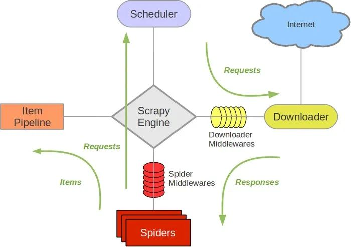

# spider-silk
All spider program.

## python and scrapy

virtualenv最流行的虚拟环境管理工具。

```bash
pip3 install virtualenv
python3 -m venv article
source article/bin/activate

pip list
pip freeze > requirements.txt
pip install -r requirements.txt
deactivate
```

**scrapy**使用的twitted架构，原理还是事件循环+回调模式，单线程机制处理的任务。



```bash
# create project
scrapy startproject article
# generic one spider
scrapy genspider cnblogs "www.cnblogs.cn"
# run spider
scrapy crawl cnblogs
```

## debug

`打断点`:断点当前行不执行
`step over`: 逐行执行代码
`step into`: 跳转进入当前行调用的函数 <不论函数是否在当前脚本文件内，都跳转>
`step into my code`: 只跳转当前脚本文件内的函数内部
`step out`: 从里面一层的函数跳转到外边一层
`run to cursor`: 运行到光标选定的代码处

## cnblogs
